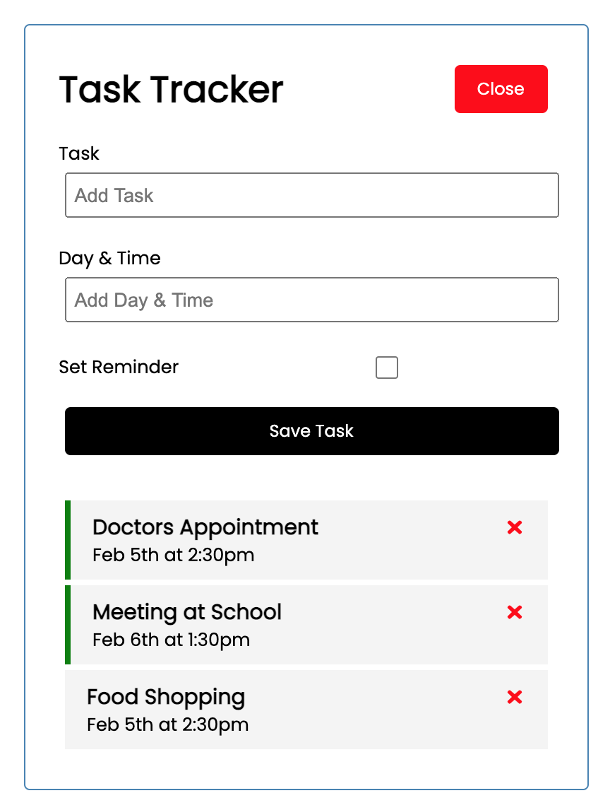

# Task Tracker Application with React


This is the project from the [YouTube](https://www.youtube.com/watch?v=w7ejDZ8SWv8) crash course. It includes the react UI as well as JSON-server for our mock backend.

This is the first project I built using React.js and it was so fun working with this phenomenal framework! 

# Usage
## Install dependencies
``` bash 
npm install
```

## Run React dev server (http://localhost:3000)

``` bash 
npm start
```

## Run the JSON server (http://localhost:5000)

``` bash 
npm run server
```

## To build for production
``` bash
npm run build
```

## Sample
Here is a snippet of what the task tracker app looks like!

